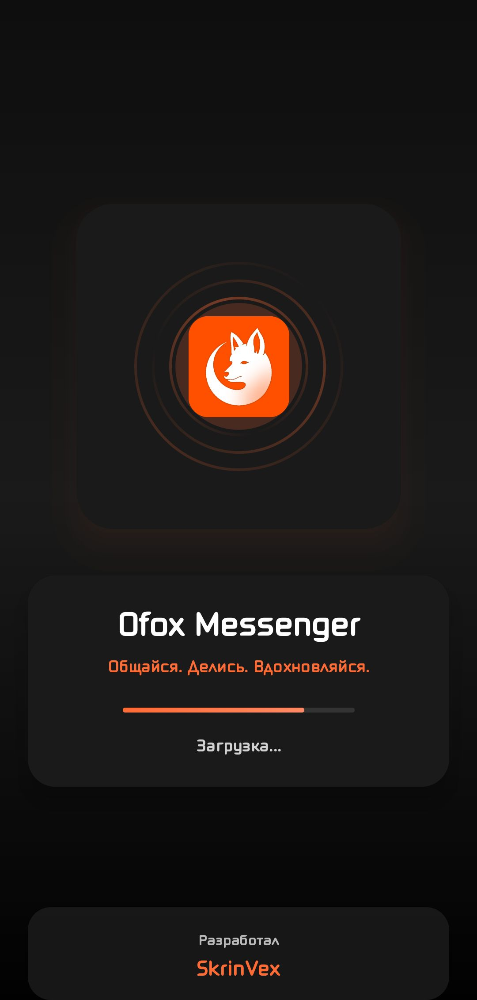
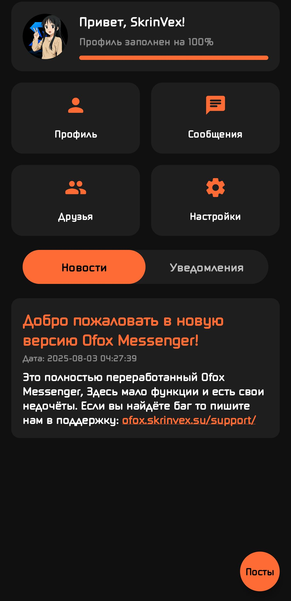
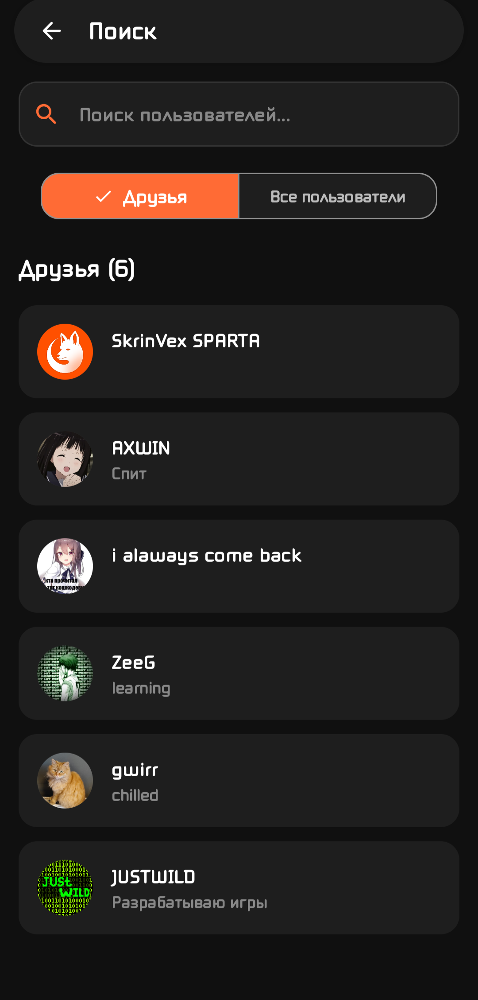

# 🦊 Ofox Messenger  
**Общайся. Делись. Вдохновляйся.**

Ofox Messenger — это современный мессенджер в стильном **черно-оранжевом дизайне**, созданный для удобного и вдохновляющего общения.  
Приложение сочетает в себе простоту, скорость и социальные функции, чтобы ты всегда оставался на связи с друзьями.

---

## ✨ Особенности

- 📰 **Главная страница** — лента новостей приложения  
- 🌐 **Общая лента постов** — публикации от пользователей  
- 💬 **Чаты** — переписка с друзьями  
- 👥 **Заявки в друзья** — находи новых знакомых  
- ❤️ **Реакции и комментарии** — общайся под постами  
- 🔔 **Уведомления** — всегда в курсе событий  
- ☁️ Основан на **Firebase** для стабильной и безопасной работы  

---

## 📸 Скриншоты

*(замени заглушки на свои реальные изображения)*  

  
  

---

## 🛠️ Технологии

- **Kotlin (Android)**
- **Jetpack Compose**
- **Firebase (Auth, Realtime Database, Cloud Messaging)**
- **Material Design / кастомный черно-оранжевый UI**
- **Собственный API / Ofox API**

---

## 🌍 Официальные ресурсы

- 📱 [Сайт приложения](https://ofox.skrinvex.su/)  
- 💬 [Поддержка](https://ofox.skrinvex.su/support/)  
- 🛠 [Сайт разработчика SkrinVex](https://skrinvex.su/)  

---

## 📜 Условия использования

Используя приложение **Ofox Messenger**, вы соглашаетесь с [условиями использования](https://ofox.skrinvex.su/terms-of-service/).  
Приложение разрабатывается и поддерживается **SkrinVex**.

---

## 👨‍💻 Разработчик

**SkrinVex**  
> Цель — создавать удобные сервисы и приложения для общения и вдохновения.
